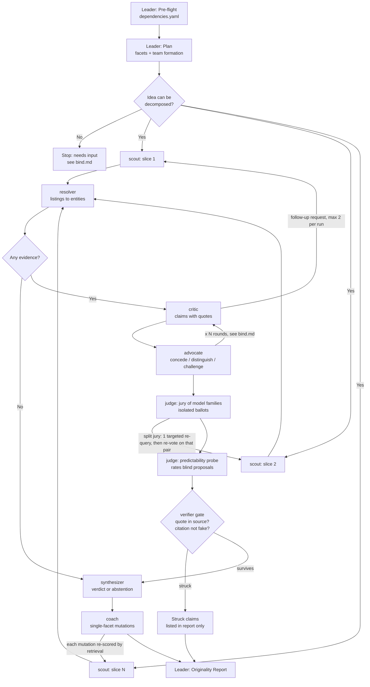

# Workflow: evidence first, argue second, verify before anyone is allowed to conclude

## Overview



The pattern is mixed. Steps 2 and 3 are a parallel decomposition by source slice followed by a specialization stage (B then C). Step 4 is a debate with isolated first moves and a jury that never hears it. Step 5 is a hard gate. Three back-edges return to the scouts: the critic's follow-up requests, the split-jury tie-break, and the re-scoring of each coached mutation. Scouts are the only role that retrieves, so every back-edge keeps retrieval isolated and logged.

- **Inter-member communication preference** (Debate pattern): this Swarm Skill declares **who sees whose output at which phase** (visibility semantics). Frameworks SHOULD implement the highest-priority delivery mechanism they support: **(1) direct peer-to-peer exchange** (most efficient) > **(2) shared blackboard** > **(3) Leader-relay** (fallback). See [bind.md](bind.md) § Behavioral Constraints for phase-scoped visibility rules.

## Detailed Steps

### Step 0 — Pre-flight: dependency check

- **Executor**: Leader
- **Input**: [dependencies.yaml](dependencies.yaml)
- **Action**: verify each `skills[]` and `tools[]` entry is available. Record which retrieval tools exist: that list decides which source slices can be staffed in Step 1.
- **Output**: pre-flight report to user
- **Quality gate**: user decides go/no-go on missing items (Agent does NOT auto-decide). With no search capability at all, the run can only abstain; say so before starting.

### Step 1 — Plan and form the team

- **Executor**: Leader
- **Input**: the idea text, an optional page describing it, an optional domain hint, the tools found in Step 0
- **Action**: decompose the idea into five facets (purpose, mechanism, audience, data, twist) and write the search queries. Staff one scout per source slice that is both relevant to this kind of idea and reachable with the available tools. Every slice that is not staffed is recorded with the reason.
- **Output**: facets, queries, staffed slices, skipped slices with reasons
- **Serial / Parallel**: serial
- **Quality gate**: purpose AND mechanism are both non-empty, and at least 1 slice is staffed. If the idea is shorter than the minimum in [bind.md](bind.md) or cannot be decomposed, stop with status `needs_input` (no team is dispatched). If no slice can be staffed, continue to Step 6, which abstains.

### Step 2 — Scout in parallel

- **Executor**: scout × N (one per staffed slice)
- **Input**: idea, facets, the scout's own slice, its queries, its assignment
- **Action**: each scout searches only its slice and returns listings with verbatim excerpts. Scouts do not see each other's results. A slice that fails or returns nothing gets one broadened retry.
- **Output**: records `{title, url, year, state, text, similarity}` per slice (`text` is the verbatim excerpt), plus a slice status: `ok`, `empty`, `degraded`, `failed` or `blocked`
- **Serial / Parallel**: parallel, all staffed scouts together, up to `max_parallel_teammates`
- **Quality gate**: every staffed slice ends with exactly one status from the list above. A blocked source is recorded as `blocked` and is never retried through another route. A record without both a title and verbatim text is dropped (the fabrication guard). Fail action: one retry per slice, then the slice is marked and confidence drops (Step 6).

### Step 3 — Resolve

- **Executor**: resolver (candidate generation and merging run in code)
- **Input**: all scout records, candidate pairs, source-reliability priors
- **Action**: candidate pairs come from shared URLs and from title similarity. Shared-URL pairs merge by rule; ambiguous pairs go to the resolver, which answers `same`, `different` or `insufficient_evidence`. Merged records become one entity; each field takes the value from the most reliable source for that field, and disagreements are kept as conflicts. A value that was derived rather than observed is marked imputed.
- **Output**: entities, each with its member records, fused fields, conflicts between sources and imputed-field markers
- **Serial / Parallel**: serial
- **Quality gate**: every candidate pair has exactly one verdict from the enum; `insufficient_evidence` never merges. More ambiguous pairs than the cap in [bind.md](bind.md) → rules only, recorded as a degradation. Zero records → skip to Step 6.

### Step 4 — Debate

- **Executor**: critic, advocate, judge (with scouts and the resolver on the back-edges)
- **Input**: idea, facets, resolved entities with their evidence text, staffed slices
- **Action**, in this order:
  1. **Critic** makes at most one claim per overlapping entity. Every claim names its entity and record, the overlapping facets, and a verbatim quote of at least four words.
  2. **Back-edge 1 (first round only)**: the critic may request follow-up searches. Each request names a facet, a staffed slice and a query. The named scouts run in parallel, the resolver folds new records in, and the critic takes a second look at the enlarged evidence.
  3. **Advocate** answers every open claim with exactly one of CONCEDE, DISTINGUISH (naming the facet that differs) or CHALLENGE, and may state distinctions that hold against all the prior work shown. It runs on a different model family from the critic.
  4. Further rounds (see [bind.md](bind.md) `debate_rounds`) run only while contested claims remain: the critic must SUSTAIN or WITHDRAW each one, and the advocate answers again.
  5. **Jury**: one juror per model family, in parallel, each isolated from the others and from the debate, rates purpose overlap and mechanism overlap for the contested entities. Mean and spread are computed in code.
  6. **Back-edge 2**: if the spread on any (entity, facet) pair reaches the split threshold, one scout is sent out with a query aimed at exactly that facet of that entity, the resolver folds the result in, and the jury re-votes on that entity only.
  7. **Predictability probe**: blind samplers receive only the problem and the audience, never the idea, and brainstorm. The judge rates how close each proposal is to the idea's mechanism and twist.
- **Output**: claims with debate status (`proposed`, `contested`, `conceded`, `sustained`, `withdrawn`), distinctions, jury tallies per (entity, facet) with mean and spread, the log of re-queries, probe samples
- **Serial / Parallel**: critic then advocate serial within a round; jurors parallel; samplers parallel; follow-up scouts parallel
- **Quality gate**: every claim has a quote and a record id, or it is dropped at intake. Every open claim has exactly one advocate response from the enum. Every juror ballot has two numbers in [0, 1] per entity. Fail actions: a silent critic or advocate is marked `[ROLE MISSING]` and the run continues; a juror that returns no ballot is dropped and recorded, and no ballot at all marks the judge `[ROLE MISSING]`; when no separate jury models are configured the jury runs on one model family and the report says its disagreement is under-estimated; an exhausted budget skips back-edges and the probe first, each recorded as a degradation.

### Step 5 — Verify (veto gate)

- **Executor**: verifier (layer 1 runs in code, not in a model)
- **Input**: all claims that were not withdrawn, their quotes, the cited evidence text and URLs
- **Action**: **Layer 1**: the quoted words must appear in the evidence text the scout returned; this is a deterministic string check with whitespace and punctuation normalised, and a quote containing an ellipsis is checked part by part. **Layer 2**: the verifier opens each cited URL and reports `exists`, `fake`, `unreachable` or `unchecked`. Only `fake` strikes a claim. **The gate is enforced outside the prompt**: the coordinator passes only surviving claims into the Step 6 and Step 7 prompts, so a struck claim cannot be argued back in.
- **Output**: per claim `{status: verified | rejected | withdrawn, quote_match, citation_status, reason}`
- **Serial / Parallel**: serial; layer 2 covers at most the cap in [bind.md](bind.md), in claim order
- **Quality gate**: every claim ends in exactly one status from the enum. A claim whose record id is not in the evidence store is `rejected`. If the verifier is unavailable, layer 1 alone gates the claims and the report says layer 2 did not run.

### Step 6 — Synthesize

- **Executor**: synthesizer (scores computed in code)
- **Input**: surviving claims with their debate, distinctions, conflicts, source status, and the computed scores
- **Action**: the coordinator computes three axes (crowding, facet rarity, model predictability; higher = more original), a headline as their weighted geometric mean over the axes that did not abstain, an uncertainty band from the jury spread, and a confidence value from source coverage, jury agreement, verified-claim share and a canary. The synthesizer then writes the verdict from surviving claims only. It never produces or changes a number.
- **Output**: `{verdict_md, crowded, different, unresolved, caveats}` plus the scores
- **Serial / Parallel**: serial
- **Quality gate**: the run **abstains** — headline withheld, "Insufficient evidence: …" with what is missing — when no source returned anything, when coverage is below `min_coverage`, or when confidence is below `min_confidence` (values in [bind.md](bind.md)). An axis with no input abstains on its own and the weights are renormalised. If the synthesizer returns nothing, a rule-written verdict is used and marked as such.

### Step 7 — Coach

- **Executor**: coach, then scout × M for re-scoring
- **Input**: idea, facets, crowded neighbours, whitespace and cliché terms, distinctions
- **Action**: the coach proposes single-facet mutations, each grounded in a whitespace term or a stated distinction. Each mutated pitch goes back to a scout; retrieval is re-run and crowding is re-measured against the original.
- **Output**: mutations `{id, facet, from, to, rationale, pitch, grounded_in, rescored, crowding_after, delta, nearest, note}`
- **Serial / Parallel**: coach serial; re-scoring scouts parallel
- **Quality gate**: every mutation names exactly 1 facet from the five and carries a rewritten pitch, or it is dropped. When re-running retrieval returns nothing usable the mutation is reported as not re-scored, with `delta: null`: no retrieval, no claimed improvement. Skipped when there is no evidence or the budget is spent; recorded as a degradation.

### Step 8 — Final: emit the Originality Report

- **Executor**: Leader
- **Input**: outputs from all upstream steps
- **Action**: compose by section. Contradictions between roles and between sources are surfaced verbatim and are not mediated. Struck claims are listed as caught errors. Actions that write outside the team (arming a recurring watch, writing the idea back to a corpus) are proposed only, and run after an explicit user confirmation.
- **Output**: Originality Report in the format below

#### Final Report Format

```markdown
# Originality Report

## Summary
<Verdict in 3 to 5 sentences, or "Insufficient evidence: <what is missing>">

## Scores
- Headline: <0-100 ± band, or withheld with the reason>
- Crowding: <score or abstained: why> · Facet rarity: <…> · Model predictability: <…>
- Confidence: <0-1> (coverage <…>, jury spread <…>, verified share <…>)

## Verified Prior Work
- [<claim id>] <entity> — "<verbatim quote>" — <citation with URL> — debate: <status>

## Struck Claims (caught by the verifier, never used)
- [<claim id>] <claim> — <reason: quote not found in source | citation judged fake>

## Conflicts Between Sources
- <entity>.<field>: <source A says …> vs <source B says …> — kept: <value> (<why>)

## Unresolved Disputes (preserved from the debate, NOT mediated)
- <Claim by critic> vs <answer by advocate> — <what the user should check>

## Coverage Map
- <slice>: <ok | empty | degraded | failed | blocked | skipped: why> (<n> records)
- Gaps: <slices nobody covered>

## Coached Mutations
- <facet>: <from> → <to> — grounded in <term> — crowding <before> → <after> (Δ <delta>) | not re-scored

## Degradations
- <everything that was skipped, capped or missing, in order>

## Proposed Actions (nothing has been executed)
- <action> — requires confirmation: <yes | no>
```

## Acceptance Criteria

- All roles returned outputs matching their `## Output Schema`, or are listed as `[ROLE MISSING]` with the reason.
- The Final Report contains all mandatory sections; an abstaining run still contains Coverage Map and Degradations.
- Every claim under Verified Prior Work passed both layers of Step 5, and no struck or withdrawn claim appears anywhere in the Summary or in a mutation's rationale.
- Every quote in the report is verbatim from a record in the evidence store.
- All unresolved disputes and source conflicts are preserved from both sides, not silently dropped or averaged.
- Every staffed and every skipped slice is accounted for in the Coverage Map.
- Every mutation that shows a delta was re-scored by retrieval.
- No action that writes outside the team ran without a recorded user confirmation.
